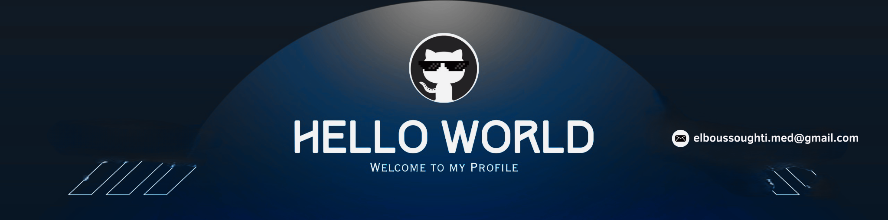

<!-- Banner -->

<!-- Right-side decoration image -->

  

<!-- Header -->
#  I'm Mohamed El Boussoughti  
*Aspiring Full Stack Developer & Software Engineering Student*

---

<!-- Intro -->

  👋 Welcome to my GitHub! I'm Mohamed from Morocco, a student at MIAGE Salé majoring in software development.  
  I love building backend systems using Laravel and MySQL, and I'm also deeply curious about how computers and programming languages work at low levels.

- 🎓 Student at **MIAGE Salé** — Specializing in Software Development  
- 🌱 Currently learning: **Laravel**, **Java**, **MySQL**, and **System Concepts**  
- 💻 Exploring how to build: **Compilers**, **Terminals**, and **Text Editors**  
- 🌐 Improving my **English** and **French** alongside coding  
- 💡 Always curious — always learning  
- 🔗 Visit my [Portfolio](https://elboussoughti.me) *(if available)*

---

<!-- Profile Views -->

  

---

<!-- Skills Animation -->
<h2 align="center">🛠 Tech Stack & Tools</h2>
<picture>
  <source media="(prefers-color-scheme: dark)" srcset="./Skills_Animation_Dark.gif">
  <source media="(prefers-color-scheme: light)" srcset="./Skills_Animation_White.gif">
  
</picture>

---

<!-- Learning -->
<h3 align="left">📚 What I'm Learning Now</h3>
<ul align="left">
  <li>Laravel & REST APIs for backend development</li>
  <li>Java and Object-Oriented Programming</li>
  <li>MySQL for database design and queries</li>
  <li>Understanding how programming languages are built</li>
  <li>How terminals, text editors, and compilers work</li>
  <li>Version control with Git and GitHub</li>
</ul>

 

---

<!-- GitHub Stats -->
<h2 align="center">📊 GitHub Stats</h2>

<table width="100%">
  <tr>
    <td width="50%" align="center">
      
    </td>
    <td width="50%" align="center">
      
    </td>
  </tr>
</table>

---

<!-- Contributions -->
<h2 align="center">📈 Contribution Graph</h2>

  

---

<!-- Quote Card -->
<h2 align="center">🌟 Thought of the Day</h2>

  

---

<!-- Contact -->
<h2 align="center">🤝 Connect With Me</h2>

---

<!-- Footer Wave -->

  

